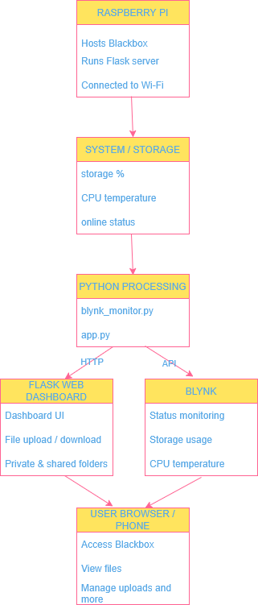

# Smart Home Cloud Pi - Blackbox

## Project overview

Smart Home Cloud Pi, also called Blackbox, is a Raspberry Pi based personal cloud storage system. The system allows users to access files through a Flask web dashboard on the local network.

The project was designed to show an IoT system using a Raspberry Pi, Python, Flask, local storage, and Blynk monitoring.

## System

The system demonstrates:

- Data input from Raspberry Pi system/storage data
- Processing using Python logic
- Networking through Flask HTTP access and Blynk API connection
- Output through a web dashboard and Blynk dashboard

## Main features

- Web dashboard for file access
- Upload files
- Download files
- View files
- Move files to Bin
- Restore or manage Bin files
- Private and shared file areas
- Admin/guest access logic
- Storage usage monitoring
- Blynk monitoring integration
- AI assistant interface named The Helmsman (didn't work properly yet)

## IoT system explanation

The Raspberry Pi collects system and storage data. Python processes this data by calculating storage usage percentage and checking system status. The processed data is displayed through the Flask web dashboard and also sent to Blynk for monitoring.

## System architecture

    -User Browser

        -Flask Web App

            -Python Application Logic

                -Raspberry Pi Storage / External HDD

    -Raspberry Pi

        -Blynk API

            -Blynk Dashboard

## Technologies used

- Raspberry Pi
- Python
- Flask
- HTML
- CSS
- JavaScript
- Blynk
- GitHub
- SD card

## Networking and Communication

This project uses networking and communication technologies to connect devices and deliver data across the local network.

### HTTP

HTTP is used by the Flask web application to serve the Blackbox dashboard through a browser on the local network.

To configure this, the Flask server was run on the Raspberry Pi using:

```bash
python src/app.py
```

This started the Flask development server on port `5000`.

The Raspberry Pi was connected to the home Wi-Fi network and assigned a local IP address.

Example:

```text
http://192.168.1.86:5000
```

The dashboard could then be opened from another device connected to the same Wi-Fi network by entering the Raspberry Pi IP address and port into a browser.

This allowed users to:

- open the Blackbox dashboard
- upload and download files
- manage shared and private folders
- access the file system through a web interface

This communication happens over HTTP between the browser and the Flask application running on the Raspberry Pi.

### Blynk Cloud API
The project uses the Blynk Python library to send Raspberry Pi system information to the Blynk dashboard.

Examples of monitored values:
- Online status
- CPU temperature
- Storage usage percentage

The Raspberry Pi sends this data to Blynk through API communication over the internet.

### Blynk Configuration
Blynk was configured to monitor Raspberry Pi system information remotely through the Blynk mobile dashboard.

The setup process included:

#### 1. Create a Blynk template
A template was created in the Blynk Console for the Blackbox project.

Example monitored values included:
- Online status
- CPU temperature
- Storage usage percentage
---

#### 2. Create datastreams
Datastreams were added inside Blynk to receive values from the Raspberry Pi.

Examples:
- Virtual Pin for Online Status
- Virtual Pin for CPU Temperature
- Virtual Pin for Storage Usage
---

#### 3. Install the Blynk Python library
The library was installed inside the Python virtual environment on the Raspberry Pi using:
```bash
pip install blynklib
```
---

#### 4. Create the monitoring script
A Python script named:
```text
blynk_monitor.py
```

was used to collect Raspberry Pi system data and send it to Blynk.

The script reads values such as:
- CPU temperature
- storage usage
- online status
and pushes them to the Blynk dashboard.
---

#### 5. Run the monitoring script
The monitoring script was started from the terminal using:
```bash
python blynk_monitor.py
```

Once running, the Raspberry Pi began sending live data to the Blynk dashboard.
---
#### 6. View data in the Blynk mobile dashboard
The data was displayed in the Blynk app using widgets configured to show:

- current Raspberry Pi status
- CPU temperature
- storage usage percentage
This allowed the Raspberry Pi to be monitored remotely from a phone.

### TCP/IP
Communication between the Raspberry Pi, browser, and Blynk platform runs over the TCP/IP network stack through the home Wi-Fi network.

This enables:
- browser access to the Flask dashboard
- communication between Python scripts and Blynk
- file management over the local network

## Data Flow

    -Raspberry Pi system data  
        -Python processing (`app.py`, `blynk_monitor.py`)  
            -HTTP / API communication over TCP/IP    
                -Flask Dashboard + Blynk Dashboard

## How to run the project

### 1. Clone the repository
```bash
git clone https://github.com/tagrgr/Smart-Home-Cloud-Pi.git
cd Smart-Home-Cloud-Pi
```

### 2. Create a Python virtual environment
```bash
python3 -m venv venv
```

### 3. Activate the virtual environment
#### On Raspberry Pi / Linux:
```bash
source venv/bin/activate
```

### 4. Install dependencies
```bash
pip install flask requests blynklib
```

### 5. Run the Flask application
```bash
python src/app.py
```

### 6. Open the dashboard
#### On the Raspberry Pi itself:
```
http://127.0.0.1:5000
```

#### From another device on the same Wi-Fi network:
```
http://RASPBERRY_PI_IP_ADDRESS:5000
```

### 7. Run the Blynk monitoring script
#### In a second terminal, activate the virtual environment again:
```bash
source venv/bin/activate
```
#### Then run:
```bash
python blynk_monitor.py
```

The Blynk dashboard should then show the Raspberry Pi status, cpu temperature and storage usage.

## Notes:
The Raspberry Pi and the user device must be connected to the same local network for local browser access.

If the project is running on a Raspberry Pi with an external HDD, the storage path must be mounted correctly before using the file dashboard.

## Architecture Diagram
